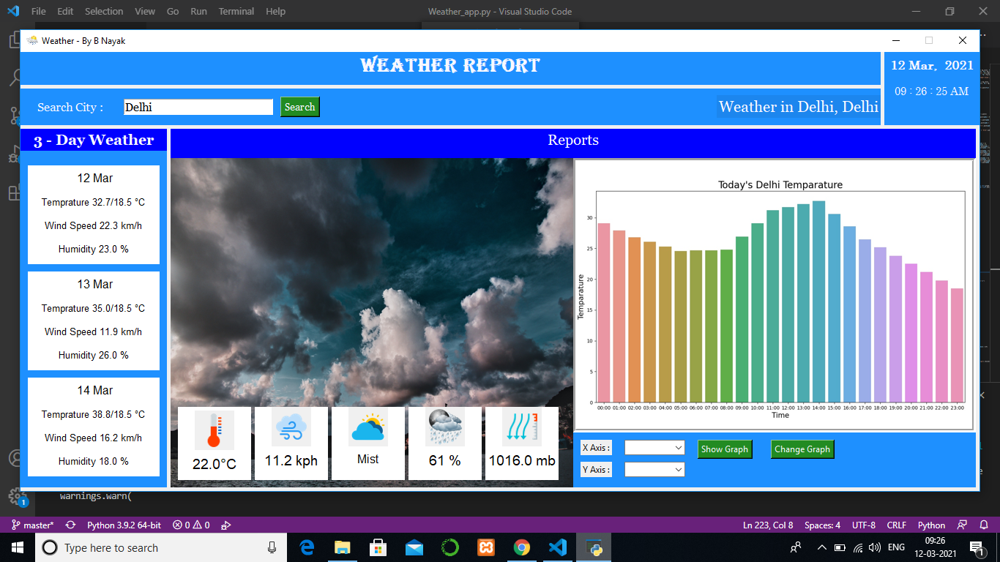

# Pocket_Weather
Now you can know about current & next 3 days weather and you can analyze today's weather with some attractive graphical figure like time-humidity, time-temperature, time-wind speed graph on your own PC easily.

It is a  Tkinter based python application. Here we collect live weather data from the server using API and make DataBase for our application and then we show information about current weather with an attractive UI.

# Dependencies
1. pip install requests 
2. pip install pandas
3. pip install matplotlib
4. pip install seaborn
5. pip install pillow

# Overview

# Download

To download this app click <a href="https://github.com/Biltu5/Pocket_Weather/archive/refs/heads/master.zip">here</a>

